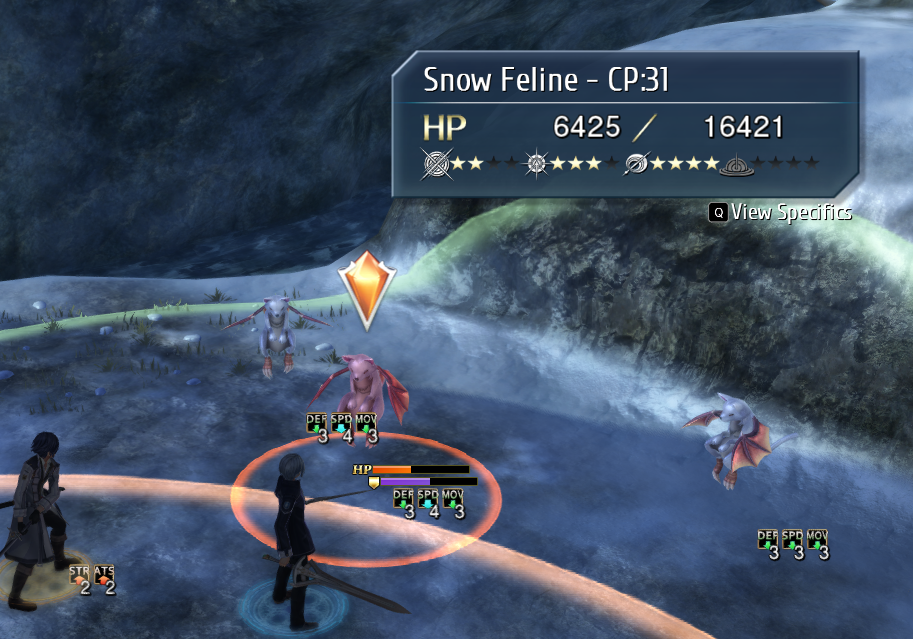

# ED8 Frida
Original work done by [Ouroboros](https://github.com/Ouroboros) and taken from https://github.com/Ouroboros/Falcom/tree/master/ED8/ed83. Extended to support and add features to Trails into Reverie. Refer to [frida/READMEOuroboros.md](frida/READMEOuroboros.md) for original information (not in English).

Frida [script](https://github.com/Drew0912/ED8Frida/tree/main/frida) and Frida [loader](https://github.com/Drew0912/ED8Frida/tree/main/FridaLoader) for The Legend of Hereos: Trails into Reverie to do exe based modifications. This is mostly for a WIP Reverie difficulty mod but some of its features may be useful for other cases.

 A [Frida](https://frida.re) loader is used here so that the end user does not need to install [Frida](https://frida.re) (and any depencencies such as python) or use command line to inject the frida script.

(TODO) Also includes code `debug_hook.py` to be used with a modified `Decompiler2` (not available) to obtain a modified `debug.dat` required for many of ED8Frida's features.

## Supported games
- Trails of Cold Steel 3 Chinese Version
    - Refer to [READMEOuroboros.md](frida/READMEOuroboros.md)
- Trails of Cold Steel 4 Japanese Version (NISA 1.2) (Not Latest)
    - Refer to [READMEOuroboros.md](frida/READMEOuroboros.md)
- Trails into Reverie (NISA V1.1.5) (Latest)
    - V1.1.4 (for GOG release) is also supported but not tested so may not work.

Note that only Windows 10 has been tested. Frida has had some issues with Windows 10 specifically (not Windows 11).

## Features

### Trails into Reverie
- Outputs debug information from the game to a command prompt.
    - Note that not all information is complete due to having to writing a quick implementation of `printf` that does not support all string formats.
    - 
    - Can be changed using custom debug menu through SE.
- Modifies info strings to indicate that ED8Frida is running along with support for custom strings.
    - Modifies version number on title screen. Does work along side Senpatcher.
    - Adds Frida Enabled to the window title name.
- File Redirection for modified files (fully disabled). Use [SenPatcher](https://github.com/AdmiralCurtiss/SenPatcher) over ED8Frida to do mod loading.
- Adds support for `debug.dat` and calling `debug.dat` with a custom debug menu.
    - Debug menu can be called from overworld where the ARCUS act menu can be used. Press `shift` and the button to open the ARCUS act menu (default key R).
    - To avoid conflicts loading/finding `debug.dat`, `debug.dat` can be either in its default location `data/scripts/scena/dat_en/debug.dat` (lower priority) or in the directory with `hnk.exe` or `bin/Win64/debug.dat` (higher priority).
    - May not be latest debug menu.
- Script Extender (SE): Custom opcode `OP_F1` to call external frida code (Need to update Readme for this).
- Enemy S-Breaks:
    - Has to be manually implemented per enemy, per fight and requires multiple script functions to be edited. Thus requires a fairly good understanding of enemy ai files and scena scripts. (May add info/tutorial on how)
    - Custom opcode for S-Breaks (only enemies are supported) through SE. 
    - Scena code required for enemy S-Breaks included in `debug.dat` which just needs to be called/set up.
- Opcode tracing for scena scripts.
    - 
    - Can be toggled using custom debug menu through SE.
- Change behaviour of abnormal status effects turn duration for enemies with the boss flag
    - Remove turn duration limit,
    - Or have the turn duration be 1 lower than normal.
- Modify values of EVA and ACC gained/lost for Insight/Blind abnormal statuses.
- Enable patch so that the remaining turns on the currently active brave order also goes down on enemy turns.
    - Can also modify the remaining turns (or display value only) through SE.
- Enable patch so that fights that count number of turns passed in combat only count player turns.
    - Note all fights have this counter, its just RP requirement fights that display and use this counter.
    - Currently requires scena edit (and SE) to `btlsys.dat` (not available).
- Enable limit to EVA (only both player and enemy). Only present in battle but EVA is only used in battle. Equipment menus will still show EVA values over the EVA limit.
- Added ability to see enemy CP values in battle by having the CP value added onto the enemies name.
    - 
    - Currently requires scena edit (and SE) to `btlsys.dat` (not available).
- Added ability through SE to edit nearly any enemy stat dynamically.
    - Examples include max HP, status and elemental efficacies, enemy EVA.

# Installation

Download and extract the `.7z` file from releases to obtain four files, `config_ED8Frida.json5`, `d3d11.dll`, `debug.dat` and `hnk.js`. Moves these files to `bin/Win64` where `hnk.exe` is. Adjust config in `config_ED8Frida.json5` to change behaviour if needed.

# To Do

- Upload modified `Decompiler2` along with any needed script files.
- S-Breaks (both player and maybe enemy) without changing AT value. (Like HSR)
- Update script support for ToCS4.
- Ability to build and play scena functions fully from ED8Frida without having to have a function in a scena script. Makes it easier for wanting functions/opcodes with minor changes (such as an id/number change) but cannot be done without multiple copies of the function, i.e functions/opcodes with no variable support.
- (Maybe) Split Frida script into multiple scripts, one for each game instead of having one Frida script for all games.
- Tutorial/info on how to implement some features that require scena edits.
- Filters (e.g opcode or function name) for opcode trace.

# Credits
- ed83 Frida (both script and loader) by [Ouroboros](https://github.com/Ouroboros)
    - https://github.com/Ouroboros/Falcom/tree/master/ED8/ed83
- Frida
    - https://frida.re/