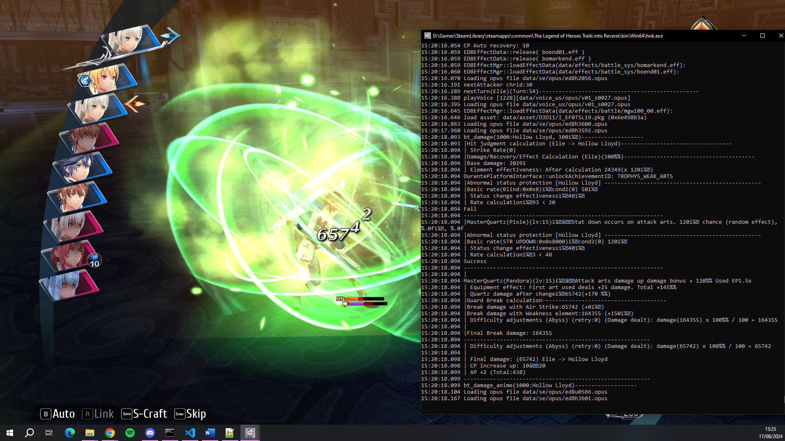

# ED8 Frida
Refer to [READMEOuroboros.md](READMEOuroboros.md) for original information, not in English.

## Supported games
- Trails of Cold Steel 3 Chinese Version
    - Refer to [READMEOuroboros.md](READMEOuroboros.md)
- Trails of Cold Steel 4 Japanese Version (NISA 1.2) (Not Latest)
    - Refer to [READMEOuroboros.md](READMEOuroboros.md)
- Trails into Reverie (NISA V1.1.5) (Latest)
    - V1.1.4 (for GOG release) is also supported but not tested so may not work.

Note that only Windows 10 has been tested. Frida has had some issues with Windows 10.

## Features
- Outputs debug information from the game to a command prompt.
    - Note that not all information is complete due to having to writing a quick implementation of `printf` that does not support all string formats.
    - 
- Modifies info strings to indicate that ED8Frida is running along with support for custom strings.
    - Includes version number on title screen. Does work along side Senpatcher.
    - Adds Frida Enabled to the window title name.
- File Redirection for modified files.
    - Recommend you use Senpatcher over this to do mod loading.
